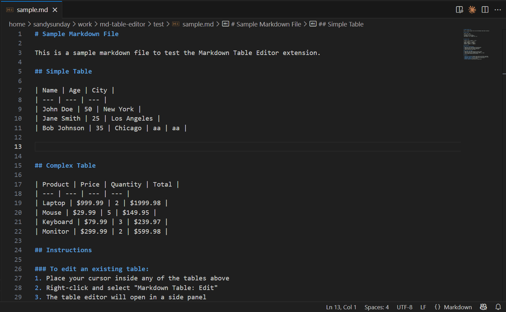
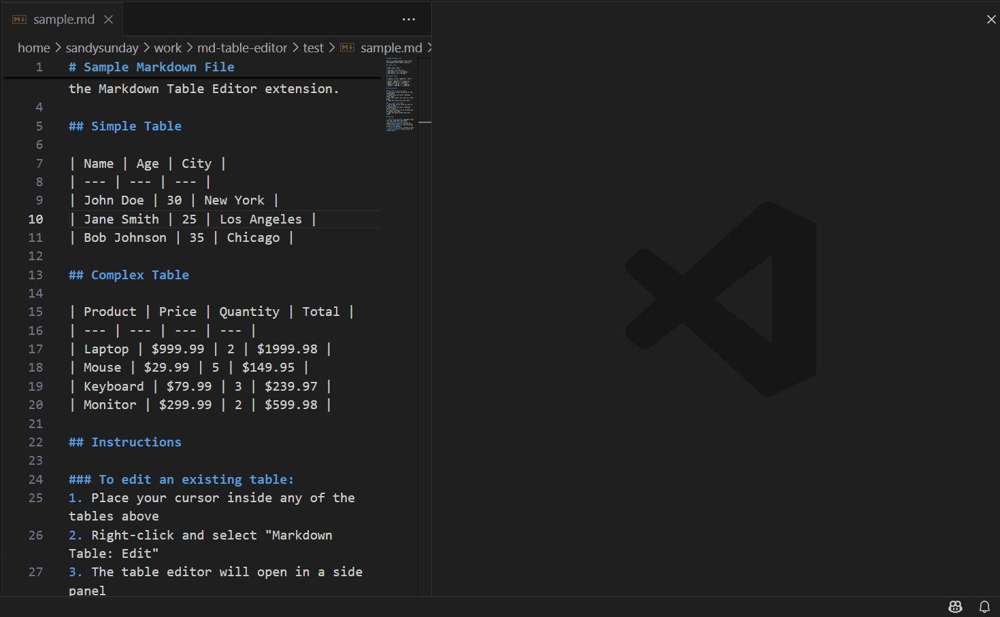

# Markdown Table Editor

A powerful VS Code extension that brings Excel-like table editing capabilities to Markdown files. Edit your markdown tables in a visual, intuitive interface instead of wrestling with pipes and dashes.


## Features

### 📊 Excel-like Table Editor
- **Visual Editing**: Edit tables in a clean, spreadsheet-like interface
- **Live Preview**: See your changes in real-time
- **Smart Navigation**: Use Tab, Shift+Tab, and Enter to navigate between cells
- **Focus Indicators**: Blue outline shows the currently selected cell

### ✏️ Table Operations
- **Create Tables**: Right-click anywhere in a markdown file to create a new table
- **Edit Existing Tables**: Right-click on any table to open the visual editor
- **Add/Remove Rows & Columns**: Easy table manipulation via buttons or context menu
- **Undo/Redo Support**: Full history tracking with Ctrl+Z and Ctrl+Y

### ⌨️ Keyboard Shortcuts
- `Ctrl+S` or `Cmd+S`: Save changes
- `Ctrl+Z` or `Cmd+Z`: Undo
- `Ctrl+Y` or `Cmd+Y`: Redo
- `Tab`: Navigate to next cell
- `Shift+Tab`: Navigate to previous cell
- `Enter`: Move down to the next row

### 🎨 Professional UI
- Clean, VS Code-themed interface
- Compact toolbar with intuitive button layout
- Status bar showing table dimensions and shortcuts
- Responsive design that adapts to your theme

## Usage

### Creating a New Table



1. Open any Markdown file (`.md`)
2. Right-click where you want to insert a table
3. Select **"Markdown Table: Create"**
4. A 2x2 table will be inserted and the editor will open
5. Edit the content and click **Save**

### Editing an Existing Table



1. Open a Markdown file containing a table
2. Right-click anywhere inside the table
3. Select **"Markdown Table: Edit"**
4. Make your changes in the visual editor
5. Click **Save** to apply changes or **Cancel** to discard

### Table Operations
- **Add Row**: Click the "+ Add Row" button or right-click a cell
- **Add Column**: Click the "+ Add Column" button or right-click a cell
- **Delete Row/Column**: Right-click any cell and select delete options
- **Undo/Redo**: Use the arrow buttons or keyboard shortcuts

## Example

Transform this:
```markdown
| Name | Age | City |
| --- | --- | --- |
| John Doe | 30 | New York |
| Jane Smith | 25 | Los Angeles |
```

Into a visual table editor where you can:
- Click any cell to edit
- Add/remove rows and columns with buttons
- Navigate with keyboard shortcuts
- See live preview of your changes

## Requirements

- VS Code version 1.74.0 or higher

## Installation

1. Open VS Code
2. Go to Extensions (Ctrl+Shift+X)
3. Search for "Markdown Table Editor"
4. Click Install

## Extension Settings

This extension works out of the box with no configuration required.

## Known Issues

- Tables must follow standard Markdown table format
- Minimum table size is 1 column x 2 rows (header + data)

## Release Notes

### 1.0.0

Initial release with:
- Visual table editor
- Create and edit tables
- Add/delete rows and columns
- Undo/redo support
- Keyboard navigation
- Professional UI design

## Contributing

Found a bug or have a feature request? Please create an issue on our [GitHub repository](https://github.com/3dy3day/md-table-editor).

## License

This extension is licensed under the [MIT License](LICENSE).

## Credits

Icon by [Pixel perfect](https://www.flaticon.com/authors/pixel-perfect) from [Flaticon](https://www.flaticon.com/)

---

**Enjoy editing Markdown tables the easy way!** 🎉
